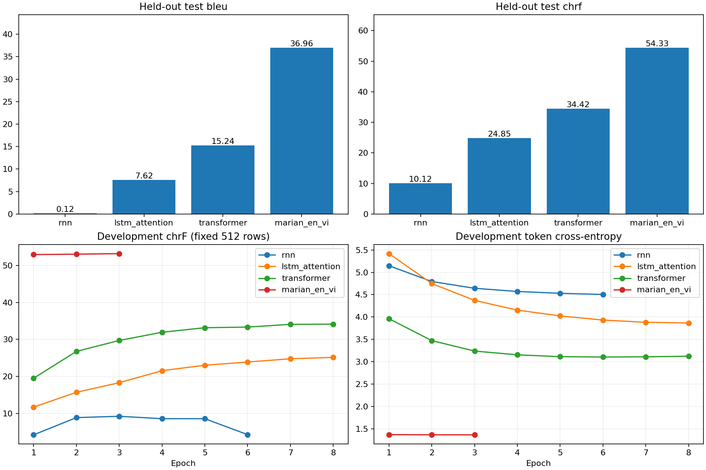

# Analysis of the supplied Kaggle NMT runs

The two-layer scratch Transformer is a usable assignment result. Its main problem
is generalization, so increasing depth is not the first change I recommend. Keep
these runs as the baseline. If you want one further experiment, give the two-layer
Transformer more training data before testing a third layer.

## What was verified

All four runs have the same data fingerprint, 25,000 training pairs, 5,000 reserved
validation pairs and 1,187 retained test pairs. Prepared-file hashes and normalized
source separation across splits pass. Recomputing BLEU/chrF from every saved test
prediction reproduces the reported scores. All four portable exports match their
selected `best.pt` weights exactly; `best.pt` and `last.pt` contain optimizer,
scheduler and RNG state and the matching data fingerprint.

The enclosing folder names are misleading: `kaggle_runs/MarianNMT` contains the
three scratch runs, while `kaggle_runs/NMT_RNN_LSTM_Trsf` contains Marian. Their
two `.log` files have the same SHA-256 and contain the scratch execution. Marian's
results are supported by its summaries, histories, predictions and checkpoints,
but the supplied logs do not provide a separate Marian console trace.

The machine-readable audit is [nmt_run_audit.json](nmt_run_audit.json).

## Results and actual architecture

| Model | Encoder/decoder layers | Width | Parameters | Test BLEU | Test chrF | Selected epoch |
|---|---:|---:|---:|---:|---:|---:|
| RNN | 1 / 1 | 128 | 2.14M | 0.12 | 10.12 | 3; stopped after 6 |
| LSTM + dot attention | 2 / 2 | 192 | 4.67M | 7.62 | 24.85 | 8 |
| Transformer | 2 / 2 | 256 | 7.83M | 15.24 | 34.42 | 8 |
| Pretrained Marian + fine-tuning | 6 / 6 | 512 | 72.15M | 36.96 | 54.33 | 3 |

There is one overall encoder–decoder **model**, but each side contains a stack of
layers. The LSTM and scratch Transformer already have two layers on each side.
Marian's old summary wrongly printed the generic wrapper settings (two layers,
width 128); its actual saved HF configuration and loaded model have six layers on
each side, width 512, eight heads and FFN width 2,048. Future summaries/export
metadata now record the effective architecture separately from requested settings.

T5 was not trained in these NMT runs. Its retained checkpoint belongs to the
previous QA experiment.

## Underfitting or overfitting?

I loaded each best export and evaluated 256 training and 256 validation examples,
randomly sampled with seed 2026 within proportional source-length strata. Both
splits were evaluated with dropout off and the same greedy decoding. These are
sampled measurements, not full-corpus train scores or the original fixed
512-example validation subset. The audit used local PyTorch 2.5.1 / Transformers
5.17.0 with the saved token IDs; the original runs used PyTorch 2.11 / Transformers
4.57.1. No model was retrained for these measurements.

| Model | Train loss | Dev loss | Train BLEU | Dev BLEU | Train chrF | Dev chrF |
|---|---:|---:|---:|---:|---:|---:|
| RNN | 4.51 | 4.61 | 0.14 | 0.19 | 9.57 | 9.27 |
| LSTM + attention | 3.56 | 3.79 | 8.29 | 7.91 | 25.23 | 25.16 |
| Transformer | **1.42** | **3.04** | **26.97** | **15.54** | **44.61** | **34.61** |
| Marian | 1.23 | 1.36 | 36.01 | 34.73 | 53.99 | 53.11 |

Compare train and dev loss **within a model**. Scratch and Marian use different
vocabularies, so their cross-entropy values are not directly comparable.

**Transformer:** its large train–dev gap is evidence of overfitting/generalization
limits, not a straightforward capacity shortage. Original dev cross-entropy falls
to 3.1046 at epoch 6, then rises to 3.1231 at epoch 8. chrF still improves slightly
from 33.345 to 34.141. This explains why selecting the epoch-8 checkpoint by chrF
is correct even though loss had already reached its minimum. More layers could
still help as an experiment, but these measurements do not justify assuming that.

**LSTM:** its small sampled generation gap and still-improving validation curve
suggest more room for optimization. Original dev chrF increases every epoch,
finishing at 25.16, and dev loss is still falling. It reached the epoch budget,
not the early-stopping threshold. A modest longer training schedule is a more
controlled first test than adding depth; a small gap alone does not prove that
additional epochs will solve its translation errors.

**RNN:** all 1,187 test outputs collapse into only **three distinct translations**.
Every prediction contains a repeated four-word sequence; mean output length is
exactly the 96-token limit. In both sampled splits it never generates EOS. This is
a serious free-running generation/source-conditioning failure, even while its
teacher-forced validation loss improves. Teacher forcing supplies the correct
previous token; generation feeds back its own mistakes. The simple recurrent
decoder must retain the source through its hidden state, whereas the attentive
models can consult source states again. More layers alone are not a demonstrated
remedy. Keep this as an honestly reported failed baseline.

**Marian:** it is the strongest translator, but dev chrF changes only 52.917 →
53.032 → 53.177 during its three fine-tuning epochs. Further fine-tuning is a low
priority. No unfine-tuned baseline was recorded, so these runs cannot quantify the
benefit of fine-tuning itself. Its advantage includes external training data,
different tokenization and much larger capacity; it is not evidence that six
layers alone explain the score gap. Prior benchmark exposure is not ruled out.

## Translation failure patterns

| Source length | Test examples | RNN BLEU | LSTM BLEU | Transformer BLEU | Marian BLEU |
|---|---:|---:|---:|---:|---:|
| 1–10 whitespace words | 276 | 0.02 | 7.97 | 20.64 | 37.52 |
| 11–20 whitespace words | 445 | 0.07 | 8.86 | 17.87 | 37.79 |
| 21–60 whitespace words | 466 | 0.24 | 7.02 | 13.17 | 36.50 |

The scratch Transformer is particularly weaker on longer sentences. Read its
actual predictions rather than interpreting BLEU alone: it often captures a
sentence's structure but substitutes entities or loses part of the meaning.
The audit includes short/medium/long examples for each model.

Predictions with any repeated four-word sequence: RNN 100%, LSTM 31.76%,
Transformer 14.32%, Marian 3.96%. This is a warning indicator, not a perfect error
label: legitimate repetition can occur. Do not automatically forbid repeated
ngrams merely to improve the reported benchmark; check semantic fidelity.

The corpus preserves its original tokenized punctuation spacing. BLEU uses the
declared SacreBLEU `13a` tokenizer, chrF is chrF2, and every stage uses the same
references. The scores describe this filtered evaluation scope, not an unqualified
published IWSLT benchmark result. Only one seed was trained.

## Errors and diagnostic fixes

The console `ERROR` messages report a dependency conflict: Transformers 4.57.1
forced Hub 0.36.2, while Kaggle's Gradio requires Hub >=1.16 and Diffusers >=1.23.
They did not terminate training. Setup now pins Transformers 5.17.0 and Hub
>=1.23,<2, retains Kaggle's CUDA PyTorch and checks for already-imported libraries
before installing. Both notebook setup cells were updated. Version requirements
were checked against the [official Transformers package metadata](https://pypi.org/pypi/transformers/5.17.0/json)
and the [Hub 1.23 release](https://pypi.org/project/huggingface-hub/1.23.0/).

The original memorization diagnostic chose the eight shortest phrases: “Hey.”,
“May.”, “Us.”, “Okay.”, “When?”, “Mill.”, “Kant.” and “Hi.”. Reproducing them proves
that a tiny lookup problem is learnable; it does not check sentence translation.
BLEU was zero because these targets are too short to supply four-grams, even
though chrF was 100. The diagnostic now selects meaningful sentences across
lengths, requires four alphabetic words per side, limits each side to 48 tokens,
and logs the selection rule. Its temporary weights are still discarded.

I ran that strengthened diagnostic locally using the actual scratch architectures:
RNN and Transformer reached chrF 100 at step 100; LSTM reached chrF 92.65 at step
700. The default budget is therefore now 1,000 steps, rather than 500. This is a
tiny diagnostic training probe, separate from the unchanged main-run weights.
It supports that the models can memorize sentences; it does not guarantee
generalization. The complete diagnostic reports are in
[nmt_diagnostic_probe.json](nmt_diagnostic_probe.json).

Evaluation now records missing-EOS and output-cap percentages. Marian generation
also explicitly clears its unused `max_length` when setting `max_new_tokens`,
avoiding the conflicting-length warning under Transformers 5.

Original uploaded artifacts were preserved. `kaggle_runs/` is excluded from Git.

## Whether to stop

For an undergraduate comparison assignment, these runs are sufficient as a
baseline: they demonstrate learned scratch translation, the effect of attention,
a stronger Transformer, and the practical advantage of a pretrained reference.
Submit the scratch Transformer as your own trained model and label Marian as the
external reference. The failed RNN and imperfect LSTM are useful findings when
explained honestly; every model does not need to be good.

If you want one further experiment, retain the two-layer Transformer and use the
full eligible training pool (`max_train_examples=None`) in a fresh output directory,
with an eight-epoch cap and existing chrF early stopping. About 120k pairs are
available before dual-tokenizer length filtering, rather than the current 25k.
This directly tests whether more examples reduce the generalization gap. Because
this changes the trained vocabulary/data fingerprint, verify the retained test IDs
before comparing it with the pilot and do not merge mismatched summaries. Treat
this as a larger-data recipe, not a pure depth experiment.

If depth is the specific scientific question, run **two versus three layers per
side** on the same frozen prepared 25k-pair corpus, width 256, FFN 1,024, seed,
optimizer schedule, epoch cap, validation subset and decoding. Use the same new
library environment for both. Choose using validation chrF; inspect train–dev
loss/chrF and repetition too. Keep the test for the final comparison. This controls
the question much better than changing width, depth, data and epochs together.

Completed scratch runs have decayed their LR to zero at step 6,256. Simply
resuming with more epochs is not supported by the checkpoint contract and would
not constitute the same schedule. Changed epochs, layers, corpus or source need
a fresh experiment directory; the untouched old source/environment remains the
route for exact continuation of an interrupted old run.

Stop after the chosen controlled extension if validation plateaus. Chasing
Marian's score by adding layers to this small scratch recipe is not a useful
completion criterion.
